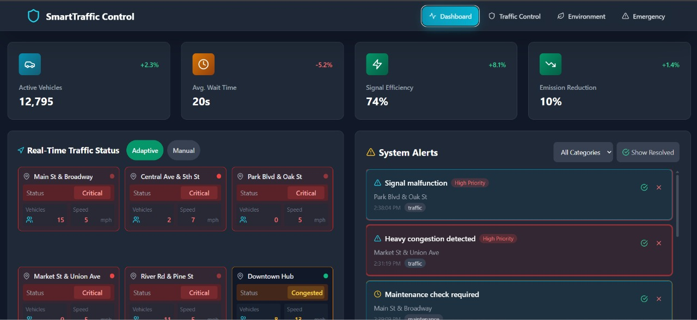
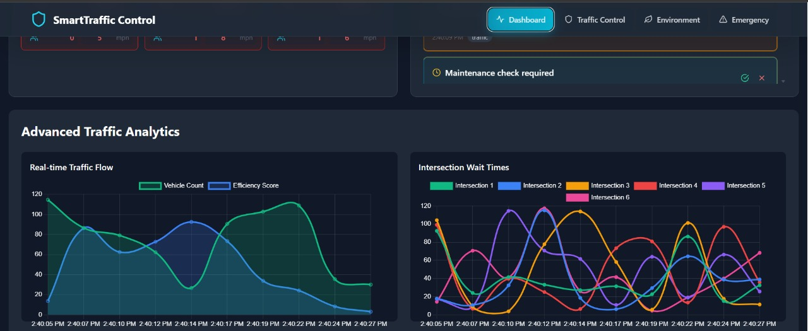
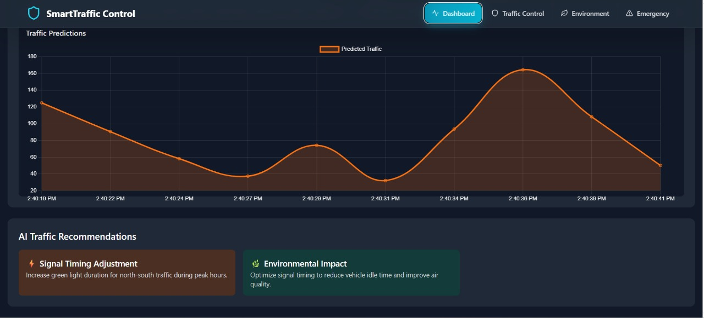
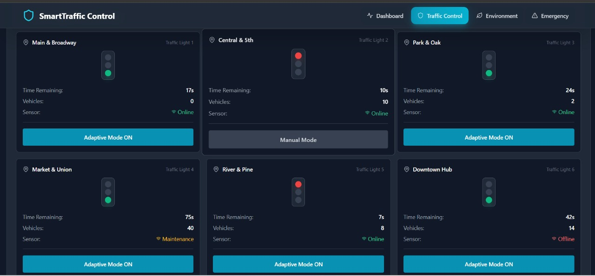
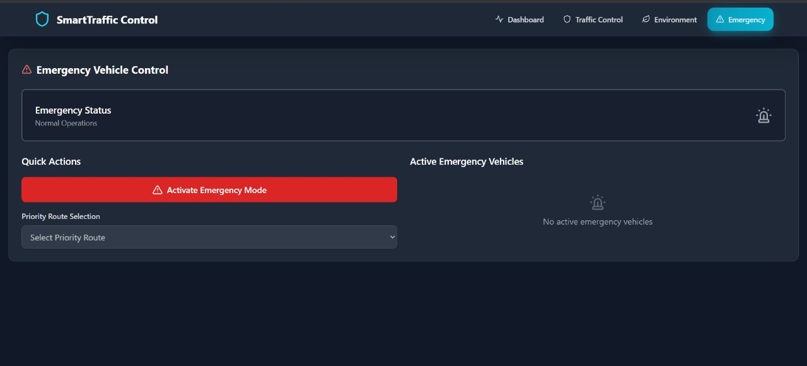
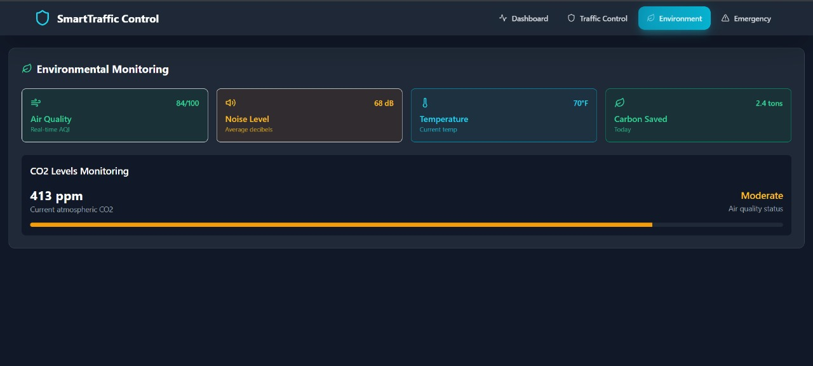

# Smart City Traffic Management System 🚦

A real-time traffic management solution developed for smart cities, featuring adaptive traffic control, emergency response system, and environmental monitoring.

## 🌟 Features

### 🚥 Traffic Control
- Real-time traffic flow monitoring
- Adaptive signal timing based on traffic density
- Interactive traffic grid visualization
- Predictive analytics for traffic patterns

### 🚨 Emergency Response System
- Priority signal control for emergency vehicles
- Real-time route optimization
- Emergency mode activation with visual indicators
- Dedicated emergency vehicle tracking

### 🌿 Environmental Monitoring
- Air quality monitoring
- Noise pollution tracking
- Weather condition integration
- Environmental impact analytics

### 📊 Advanced Analytics
- Traffic pattern analysis
- Historical data visualization
- Predictive congestion modeling
- Performance metrics dashboard

## 🛠️ Technologies Used

- **Frontend**: React + TypeScript
- **Styling**: Tailwind CSS
- **Icons**: Lucide React
- **Build Tool**: Vite
- **State Management**: React Hooks
- **Data Visualization**: Custom Grid System

## 🚀 Getting Started

### Prerequisites
- Node.js (v16 or higher)
- npm or yarn

### Installation

1. Clone the repository
```bash
git clone https://github.com/Ashis-404/Smart_City_Traffic_Management_System.git
cd Smart_City_Traffic_Management_System
```

2. Install dependencies
```bash
npm install
# or
yarn install
```

3. Start the development server
```bash
npm run dev
# or
yarn dev
```

4. Open your browser and navigate to `http://localhost:5173`

## 💡 Key Features in Detail

### Adaptive Traffic Control
- Dynamic signal timing adjustment
- Real-time traffic density monitoring
- Automatic congestion detection
- Smart intersection management

### Emergency Vehicle Priority
- Automatic signal preemption
- Optimal route calculation
- Real-time emergency vehicle tracking
- Visual confirmation of emergency routes

### Alert System
- Real-time incident reporting
- Alert categorization
- Resolution tracking
- Historical alert analysis

### Mobile Responsiveness
- Responsive design for all screen sizes
- Touch-friendly interface
- Hamburger menu for mobile navigation
- Optimized mobile layouts

## 🎯 Use Cases

1. **Traffic Management Centers**
   - Monitor citywide traffic patterns
   - Manage traffic signals in real-time
   - Respond to traffic incidents
   - Generate traffic analysis reports

2. **Emergency Services**
   - Optimize emergency response routes
   - Coordinate multiple emergency vehicles
   - Monitor emergency situation status
   - Track response times

3. **City Planners**
   - Analyze traffic patterns
   - Identify congestion hotspots
   - Plan infrastructure improvements
   - Monitor environmental impact

4. **Public Safety Officials**
   - Monitor emergency situations
   - Coordinate response efforts
   - Track incident resolution
   - Analyze response effectiveness

## 👥 Target Users

- Traffic Management Operators
- Emergency Response Teams
- City Planners
- Environmental Monitoring Teams
- Public Safety Officials

## 🔜 Future Enhancements

- Machine Learning for traffic prediction
- Integration with traffic cameras
- Mobile app for field operators
- Public transit system integration
- Weather-based traffic optimization
- IoT sensor integration with Arduino 

## 📚 Technical Documentation

### Hardware Integration
- Arduino Documentation for IoT Sensors: [Arduino Uno Rev3 Documentation](https://drive.google.com/file/d/1NaLPZ5kibx62S73taRf-cOHzrMPYV8tZ/view?usp=sharing)

## 🤝 Contributing

We welcome contributions to the Smart City Traffic Management System! Please read our contributing guidelines and submit pull requests for any enhancements.

## 📝 License

This project is licensed under the MIT License.

## 🎨 UI Screenshots

### Main Dashboard Views

*Main dashboard interface showing real-time traffic monitoring*


*Advanced analytics and traffic patterns visualization*


*Comprehensive city-wide traffic overview*

### Traffic Control System

*Interactive traffic grid system with real-time signal control*

### Emergency Response Interface

*Emergency vehicle routing and priority signal management*

### Environmental Monitoring

*Real-time environmental metrics and impact analysis*

## 🏆 Hackathon Information

This project was developed for IOTricity S02 with the goal of creating an innovative solution for modern smart city traffic management. Our focus was on combining real-time traffic control with emergency response capabilities while maintaining environmental awareness.

### Team Members

| Name | Role | LinkedIn | GitHub |
|------|------|----------|--------|
| Prattyan Ghosh | Team Lead + Backend Developer | [](https://www.linkedin.com/in/prattyanghosh/) | [](https://github.com/prattyan) |
| Ashis Mahato | Frontend Developer | [](https://www.linkedin.com/in/ashis-mahato-9733332b8/) | [](https://github.com/Ashis-404) |
| Arnab Ghosh | Frontend Developer | [](https://www.linkedin.com/in/arnab-ghosh-854854289/) | [](https://github.com/arnabg2005) |
| Aritra Debnath | Ideation person  | [](https://www.linkedin.com/in/aritradeb07/) | [](https://github.com/AritraDeb05) |
| Debasmita Deb | Writer | [](https://www.linkedin.com/in/debasmita-deb-7883392b8/) | [](https://github.com/Debasmita-Deb-555) |


---

Developed with ❤️ for smarter cities
